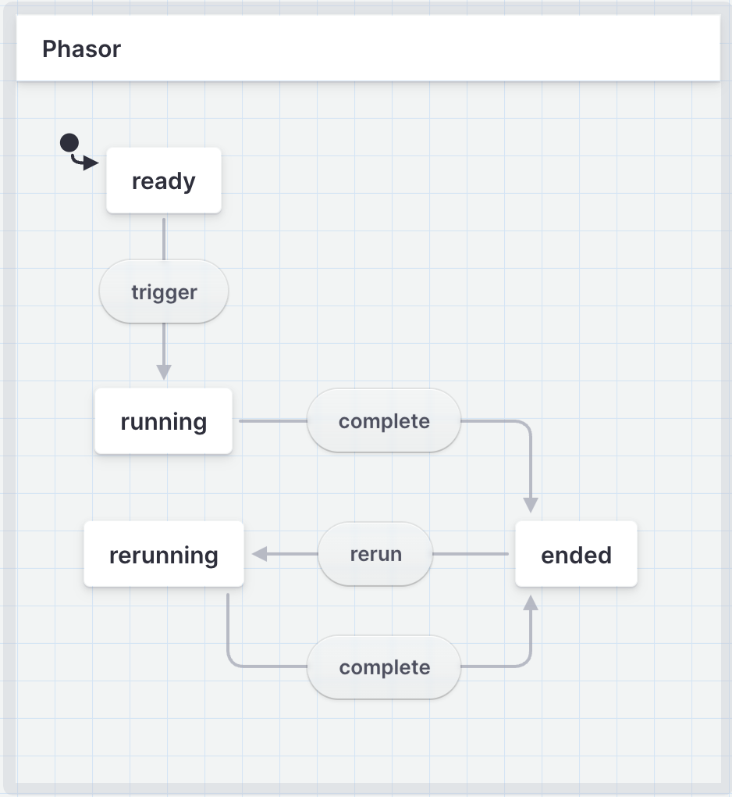

# `@ax/phasors`

This library attempts to define a few types (and helpers that go along with it) to represent an async operation (like a network request) as a more explicit JS object that is part of a state machine. The main goal is to make it easy to examine and watch such an object for changes. This is also very helpful in react-ish world where object representation can help implement and debug systems around async work.

> _In physics and engineering, a phasor (a portmanteau of 'phase vector') is a complex number representing a sinusoidal function whose amplitude, angular frequency, and initial phase are time-invariant  - [Phasor - Wikipedia](https://en.wikipedia.org/wiki/Phasor)_

- [ ] TODO: Write here about how it is used in most network request frameworks

## The Concept

The following state diagram represents the concept clearer.

[Check out this state machine](https://stately.ai/registry/editor/cd6b4740-a66f-458f-911a-19a95bd13900?machineId=63ce6936-c138-446f-8dbf-5a56e1a28951) created using [`xstate`](https://stately.ai/)

> **Fun fact:** This diagram is actually one of the most used examples of xstate and I only had to change the names in there. They call it fetch machine - [check it out here](https://xstate.js.org/viz/).

- [ ] TODO: Explain how this state diagram works

## Use cases

- [ ] TODO
